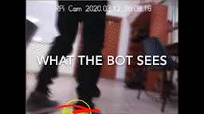
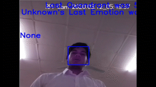

# AI-Pet

The primary objective of this project is to make an AI based pet that can interact seamlessly with humans and react based on the inputs it receives from its array of sensors and cameras. We aim to make this pet a smart robot with multiple functions and capabilities to keep its human companion engaged.

# Working

Following is the Connection Diagram

Following is the Architecture Diagram

# Features
1) Detect and track a face (only the head of the bot)
2) Recognise a face
3) Understand emotions
4) Can follow a person wearing Fluorescent Yellow sneakers
5) Play stone paper sissors
6) Can play music and dance

# Demos
You can view the full demo and explanation at https://www.youtube.com/watch?v=lxDzJWlctn4

Follow function

Follow function from the POV of the robot

Face Tracking function

# Note
You dont need a pi cam necessarily, you can use any Ip Camera

# Hardware Used
1) Raspberry Pi 4
2) Remote server (any computer capable or running ML Algos)
3) Arduino boards and assorted modules
4) IP camera: can be a mobile phone cam or even a Pi cam

# Authors
* **Elton Lemos** - [icefrostpeng](https://github.com/icefrostpeng)
* **Abhishek Ghoshal** - [abhighosh98](https://github.com/abhighosh98)
* **Aditya Aspat** - Not on Git yet
